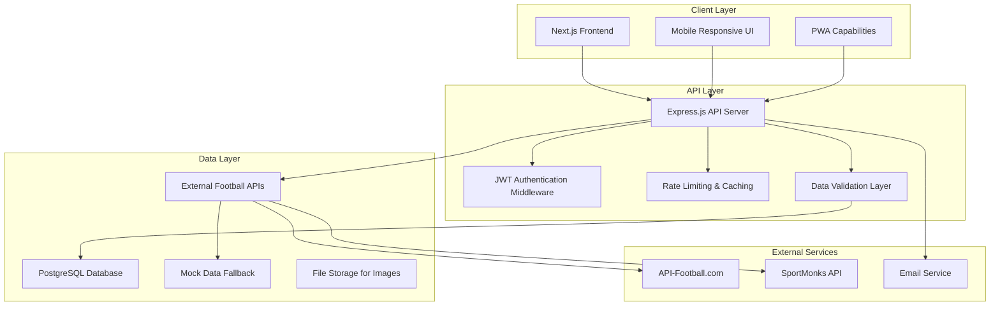

# Design Document: Football Platform

## Overview

The Football Platform is a comprehensive web application built with modern technologies to provide football enthusiasts with player databases, team management tools, tactical analysis, and interactive features. The platform follows a microservices-inspired architecture with clear separation between frontend, backend API, and data layers.

**Technology Stack:**
- **Frontend**: Next.js 14 with App Router, React 18, Tailwind CSS
- **Backend**: Node.js with Express.js REST API
- **Database**: PostgreSQL with JSON columns for flexible statistics storage
- **Authentication**: JWT-based authentication with refresh tokens
- **External APIs**: API-Football.com (primary), SportMonks (secondary), with fallback mock datasets
- **Deployment**: Vercel (frontend), Railway/Heroku (backend), PostgreSQL Cloud

## Architecture

The platform follows a three-tier architecture with clear separation of concerns:



**Key Architectural Decisions:**

1. **Next.js App Router**: Leverages server components for better performance and SEO
2. **PostgreSQL over MongoDB**: Chosen for ACID compliance, complex relational queries, and mature ecosystem for sports statistics
3. **REST API Design**: Simple, cacheable, and widely understood interface
4. **JWT Authentication**: Stateless authentication suitable for distributed deployment
5. **Hybrid Data Strategy**: External APIs for live data, local storage for user-generated content

## Components and Interfaces

### Frontend Components

**Core Layout Components:**
- `Layout`: Main application shell with navigation and theme provider
- `Header`: Navigation bar with search, user menu, and theme toggle
- `Sidebar`: Collapsible navigation for different platform sections
- `Footer`: Links, legal information, and social media

**Player & Team Components:**
- `PlayerCard`: Reusable player information display with statistics
- `PlayerProfile`: Detailed player view with career history and stats
- `TeamCard`: Team overview with key metrics and recent performance
- `TeamProfile`: Comprehensive team page with squad, fixtures, and history
- `PlayerComparison`: Side-by-side player statistics comparison
- `LeagueTable`: Sortable league standings with team performance metrics

**Interactive Components:**
- `FormationBuilder`: Drag-and-drop team formation creator
- `TacticalBoard`: Interactive football pitch visualization
- `SearchFilters`: Advanced filtering interface for player/team search
- `QuizEngine`: Interactive quiz component with scoring and feedback
- `TransferMarket`: Simulation interface for player transfers

**UI Components:**
- `Button`: Consistent button styling with variants
- `Input`: Form input components with validation
- `Modal`: Reusable modal dialogs
- `LoadingSpinner`: Loading states for async operations
- `ErrorBoundary`: Error handling and fallback UI

### Backend API Endpoints

**Authentication Endpoints:**
```
POST /api/auth/register - User registration
POST /api/auth/login - User authentication
POST /api/auth/refresh - Token refresh
POST /api/auth/logout - User logout
POST /api/auth/forgot-password - Password reset request
POST /api/auth/reset-password - Password reset confirmation
```

**Player Data Endpoints:**
```
GET /api/players - List players with filtering and pagination
GET /api/players/:id - Get specific player details
GET /api/players/:id/statistics - Get player statistics by season
GET /api/players/search - Advanced player search
GET /api/players/compare - Compare multiple players
```

**Team & League Endpoints:**
```
GET /api/teams - List teams with filtering
GET /api/teams/:id - Get specific team details
GET /api/teams/:id/squad - Get team squad information
GET /api/leagues - List available leagues
GET /api/leagues/:id - Get league details and standings
GET /api/leagues/:id/fixtures - Get league fixtures and results
```

**User Features Endpoints:**
```
GET /api/users/profile - Get user profile
PUT /api/users/profile - Update user profile
GET /api/users/favorites - Get user favorites
POST /api/users/favorites - Add to favorites
DELETE /api/users/favorites/:id - Remove from favorites
GET /api/users/formations - Get saved formations
POST /api/users/formations - Save formation
```

**Interactive Features Endpoints:**
```
GET /api/quiz/categories - Get quiz categories
GET /api/quiz/:category - Get quiz questions
POST /api/quiz/submit - Submit quiz answers
GET /api/transfer-market - Get transfer market data
POST /api/transfer-market/simulate - Simulate transfer
```

**Admin Endpoints:**
```
GET /api/admin/players - Admin player management
POST /api/admin/players - Create new player
PUT /api/admin/players/:id - Update player
DELETE /api/admin/players/:id - Delete player
GET /api/admin/analytics - Platform analytics
```

### External API Integration

**Primary Data Source - API-Football.com:**
- Comprehensive coverage of 1000+ leagues
- Real-time match data and statistics
- Player profiles and career statistics
- Team information and squad details
- Rate limit: 100 requests/day (free tier)

**Secondary Data Source - SportMonks:**
- 2500+ leagues coverage
- Advanced player statistics
- Historical data and trends
- Backup for primary API failures
- Rate limit: 180 requests/hour

**Fallback Mock Data:**
- Static JSON datasets for development and testing
- Covers major leagues (Premier League, La Liga, Serie A, Bundesliga)
- Player statistics from recent seasons
- Ensures platform functionality during API outages

## Data Models

### Database Schema (PostgreSQL)

**Users Table:**
```sql
CREATE TABLE users (
    id SERIAL PRIMARY KEY,
    email VARCHAR(255) UNIQUE NOT NULL,
    password_hash VARCHAR(255) NOT NULL,
    username VARCHAR(50) UNIQUE NOT NULL,
    first_name VARCHAR(100),
    last_name VARCHAR(100),
    avatar_url VARCHAR(500),
    preferences JSONB DEFAULT '{}',
    created_at TIMESTAMP DEFAULT CURRENT_TIMESTAMP,
    updated_at TIMESTAMP DEFAULT CURRENT_TIMESTAMP,
    is_active BOOLEAN DEFAULT true,
    email_verified BOOLEAN DEFAULT false
);
```

**Players Table:**
```sql
CREATE TABLE players (
    id SERIAL PRIMARY KEY,
    external_id VARCHAR(50) UNIQUE, -- API reference ID
    name VARCHAR(200) NOT NULL,
    age INTEGER,
    nationality VARCHAR(100),
    position VARCHAR(50),
    club_id INTEGER REFERENCES clubs(id),
    league_id INTEGER REFERENCES leagues(id),
    market_value DECIMAL(15,2),
    statistics JSONB DEFAULT '{}', -- Flexible stats storage
    achievements JSONB DEFAULT '[]',
    image_url VARCHAR(500),
    created_at TIMESTAMP DEFAULT CURRENT_TIMESTAMP,
    updated_at TIMESTAMP DEFAULT CURRENT_TIMESTAMP
);
```

**Clubs Table:**
```sql
CREATE TABLE clubs (
    id SERIAL PRIMARY KEY,
    external_id VARCHAR(50) UNIQUE,
    name VARCHAR(200) NOT NULL,
    short_name VARCHAR(50),
    country VARCHAR(100),
    league_id INTEGER REFERENCES leagues(id),
    founded_year INTEGER,
    stadium VARCHAR(200),
    logo_url VARCHAR(500),
    colors JSONB DEFAULT '{}',
    statistics JSONB DEFAULT '{}',
    created_at TIMESTAMP DEFAULT CURRENT_TIMESTAMP,
    updated_at TIMESTAMP DEFAULT CURRENT_TIMESTAMP
);
```

**Leagues Table:**
```sql
CREATE TABLE leagues (
    id SERIAL PRIMARY KEY,
    external_id VARCHAR(50) UNIQUE,
    name VARCHAR(200) NOT NULL,
    country VARCHAR(100),
    season VARCHAR(20),
    logo_url VARCHAR(500),
    standings JSONB DEFAULT '[]',
    created_at TIMESTAMP DEFAULT CURRENT_TIMESTAMP,
    updated_at TIMESTAMP DEFAULT CURRENT_TIMESTAMP
);
```

**User Favorites Table:**
```sql
CREATE TABLE user_favorites (
    id SERIAL PRIMARY KEY,
    user_id INTEGER REFERENCES users(id) ON DELETE CASCADE,
    entity_type VARCHAR(20) NOT NULL, -- 'player', 'team', 'league'
    entity_id INTEGER NOT NULL,
    created_at TIMESTAMP DEFAULT CURRENT_TIMESTAMP,
    UNIQUE(user_id, entity_type, entity_id)
);
```

**Formations Table:**
```sql
CREATE TABLE formations (
    id SERIAL PRIMARY KEY,
    user_id INTEGER REFERENCES users(id) ON DELETE CASCADE,
    name VARCHAR(200) NOT NULL,
    formation_type VARCHAR(20), -- '4-4-2', '4-3-3', etc.
    players JSONB NOT NULL, -- Array of player positions and IDs
    tactics JSONB DEFAULT '{}',
    is_public BOOLEAN DEFAULT false,
    created_at TIMESTAMP DEFAULT CURRENT_TIMESTAMP,
    updated_at TIMESTAMP DEFAULT CURRENT_TIMESTAMP
);
```

**Quiz Questions Table:**
```sql
CREATE TABLE quiz_questions (
    id SERIAL PRIMARY KEY,
    category VARCHAR(100) NOT NULL,
    difficulty VARCHAR(20) DEFAULT 'medium',
    question TEXT NOT NULL,
    options JSONB NOT NULL, -- Array of answer options
    correct_answer INTEGER NOT NULL, -- Index of correct option
    explanation TEXT,
    created_at TIMESTAMP DEFAULT CURRENT_TIMESTAMP,
    is_active BOOLEAN DEFAULT true
);
```

**User Quiz Attempts Table:**
```sql
CREATE TABLE user_quiz_attempts (
    id SERIAL PRIMARY KEY,
    user_id INTEGER REFERENCES users(id) ON DELETE CASCADE,
    category VARCHAR(100),
    questions_answered INTEGER DEFAULT 0,
    correct_answers INTEGER DEFAULT 0,
    score DECIMAL(5,2),
    completed_at TIMESTAMP DEFAULT CURRENT_TIMESTAMP
);
```

**Transfer Simulations Table:**
```sql
CREATE TABLE transfer_simulations (
    id SERIAL PRIMARY KEY,
    user_id INTEGER REFERENCES users(id) ON DELETE CASCADE,
    player_id INTEGER REFERENCES players(id),
    from_club_id INTEGER REFERENCES clubs(id),
    to_club_id INTEGER REFERENCES clubs(id),
    transfer_fee DECIMAL(15,2),
    simulation_date TIMESTAMP DEFAULT CURRENT_TIMESTAMP
);
```

### Data Relationships

**Key Relationships:**
- Players belong to Clubs (many-to-one)
- Clubs belong to Leagues (many-to-one)
- Users can favorite multiple Players/Teams/Leagues (many-to-many)
- Users can create multiple Formations (one-to-many)
- Formations contain multiple Players (many-to-many through JSONB)
- Quiz attempts track user performance over time

**Indexing Strategy:**
```sql
-- Performance indexes
CREATE INDEX idx_players_club_id ON players(club_id);
CREATE INDEX idx_players_position ON players(position);
CREATE INDEX idx_players_nationality ON players(nationality);
CREATE INDEX idx_clubs_league_id ON clubs(league_id);
CREATE INDEX idx_user_favorites_user_id ON user_favorites(user_id);
CREATE INDEX idx_formations_user_id ON formations(user_id);

-- Search indexes
CREATE INDEX idx_players_name_gin ON players USING gin(to_tsvector('english', name));
CREATE INDEX idx_clubs_name_gin ON clubs USING gin(to_tsvector('english', name));
```

## Correctness Properties

*A property is a characteristic or behavior that should hold true across all valid executions of a system—essentially, a formal statement about what the system should do. Properties serve as the bridge between human-readable specifications and machine-verifiable correctness guarantees.*

### Property 1: Data Integrity and Storage
*For any* player, club, or league entity, when stored in the database, all required fields should be preserved and retrievable with consistent formatting and proper validation.
**Validates: Requirements 1.1, 1.3, 1.5**

### Property 2: Profile Completeness
*For any* club, team, or league profile request, the rendered profile should contain all required components (squad lists, standings, formations, statistics, historical data) as specified for that entity type.
**Validates: Requirements 2.1, 2.2, 2.5**

### Property 3: Relational Data Consistency
*For any* data modification operation (create, update, delete), all related entities should maintain referential integrity and cascading updates should preserve data consistency across the system.
**Validates: Requirements 2.3, 2.4**

### Property 4: Search and Filter Accuracy
*For any* combination of search filters (country, club, league, age, position, rating), the returned results should match all specified criteria, and saved filter sets should be retrievable with identical behavior.
**Validates: Requirements 3.1, 3.2, 3.5**

### Property 5: Formation Management Completeness
*For any* team formation operation (creation, modification, saving), the system should validate position compatibility, enforce squad limits, calculate team metrics correctly, and persist complete formation data for future retrieval.
**Validates: Requirements 4.1, 4.2, 4.3, 4.4, 4.5**

### Property 6: Tactical Visualization Accuracy
*For any* formation or tactical board operation, the system should render accurate pitch proportions, position players correctly according to their roles, support dynamic updates, highlight formation differences, and export valid diagrams.
**Validates: Requirements 5.1, 5.2, 5.3, 5.4, 5.5**

### Property 7: Quiz Engine Functionality
*For any* quiz interaction, the system should deliver properly categorized questions, calculate scores correctly, provide appropriate feedback for incorrect answers, and track user performance accurately over time.
**Validates: Requirements 6.1, 6.2, 6.3, 6.4, 6.5**

### Property 8: Transfer Simulation Integrity
*For any* transfer operation, the system should calculate realistic valuations, validate budget and squad constraints, update market dynamics correctly, apply cascading updates to affected teams, and maintain accurate transfer history.
**Validates: Requirements 7.1, 7.2, 7.3, 7.4, 7.5**

### Property 9: User Authentication and Management
*For any* user authentication operation, the system should validate credentials correctly, enforce registration requirements, maintain complete user profiles, organize favorites properly, and handle password reset securely.
**Validates: Requirements 8.1, 8.2, 8.3, 8.4, 8.5**

### Property 10: Responsive Design Consistency
*For any* viewport size between 320px and 1920px, the system should render correctly, maintain theme consistency across light/dark modes, support keyboard navigation, provide loading indicators, and meet accessibility standards.
**Validates: Requirements 9.1, 9.2, 9.3, 9.4, 9.5**

### Property 11: Data Integration Reliability
*For any* external data operation, the system should integrate APIs correctly, fallback to cached data when APIs fail, validate and sanitize all incoming data, handle rate limits appropriately, and maintain accurate data freshness indicators.
**Validates: Requirements 10.1, 10.2, 10.3, 10.4, 10.5**

### Property 12: Administrative Control Completeness
*For any* administrative operation, the system should provide complete management interfaces, log all changes with proper attribution, validate changes before application, support bulk operations with rollback, and restrict access to authorized users only.
**Validates: Requirements 11.1, 11.2, 11.3, 11.4, 11.5**

### Property 13: Caching System Effectiveness
*For any* frequently accessed data request, the caching system should improve response times and maintain data consistency between cached and source data.
**Validates: Requirements 12.3**

## Error Handling

### Client-Side Error Handling

**Network Errors:**
- Implement retry mechanisms with exponential backoff
- Display user-friendly error messages for API failures
- Provide offline mode with cached data when possible
- Show connection status indicators

**Validation Errors:**
- Real-time form validation with clear error messages
- Prevent invalid data submission at the UI level
- Highlight problematic fields with specific error descriptions
- Maintain form state during error correction

**Authentication Errors:**
- Automatic token refresh for expired sessions
- Redirect to login for unauthorized access
- Clear error messages for invalid credentials
- Secure handling of authentication failures

### Server-Side Error Handling

**API Error Responses:**
```javascript
// Standardized error response format
{
  "error": {
    "code": "VALIDATION_ERROR",
    "message": "Invalid player data provided",
    "details": {
      "field": "age",
      "value": -5,
      "constraint": "must be positive integer"
    },
    "timestamp": "2024-01-15T10:30:00Z"
  }
}
```

**Database Error Handling:**
- Connection pool management with automatic reconnection
- Transaction rollback for data integrity failures
- Constraint violation handling with meaningful messages
- Query timeout handling with appropriate fallbacks

**External API Error Handling:**
- Circuit breaker pattern for failing APIs
- Graceful degradation to cached or mock data
- Rate limit handling with request queuing
- API response validation and sanitization

### Error Monitoring and Logging

**Logging Strategy:**
- Structured logging with correlation IDs
- Error severity levels (DEBUG, INFO, WARN, ERROR, FATAL)
- Performance metrics and response time tracking
- User action tracking for debugging

**Monitoring Integration:**
- Real-time error alerting for critical failures
- Performance monitoring and bottleneck identification
- User experience tracking and error impact analysis
- Automated health checks and uptime monitoring

## Testing Strategy

### Dual Testing Approach

The platform requires both unit testing and property-based testing to ensure comprehensive coverage:

**Unit Tests:**
- Focus on specific examples, edge cases, and error conditions
- Test individual components and functions in isolation
- Verify integration points between system components
- Validate error handling and boundary conditions

**Property-Based Tests:**
- Verify universal properties across all possible inputs
- Use randomized input generation to discover edge cases
- Validate system behavior under various conditions
- Ensure correctness properties hold for all valid scenarios

### Property-Based Testing Configuration

**Testing Framework:** fast-check (JavaScript/TypeScript property-based testing library)

**Configuration Requirements:**
- Minimum 100 iterations per property test
- Each property test must reference its design document property
- Tag format: **Feature: football-platform, Property {number}: {property_text}**
- Seed-based randomization for reproducible test failures

**Example Property Test Structure:**
```javascript
import fc from 'fast-check';

// Feature: football-platform, Property 1: Data Integrity and Storage
test('player data storage preserves all required fields', () => {
  fc.assert(fc.property(
    playerArbitrary, // Custom generator for player objects
    (player) => {
      const stored = database.store(player);
      const retrieved = database.retrieve(stored.id);
      
      // All required fields should be preserved
      expect(retrieved.name).toBe(player.name);
      expect(retrieved.age).toBe(player.age);
      expect(retrieved.nationality).toBe(player.nationality);
      // ... validate all required fields
      
      // Data should be consistently formatted
      expect(typeof retrieved.market_value).toBe('number');
      expect(Array.isArray(retrieved.achievements)).toBe(true);
    }
  ), { numRuns: 100 });
});
```

### Testing Coverage Areas

**Frontend Testing:**
- Component rendering and interaction testing
- Responsive design validation across viewport sizes
- Theme switching and accessibility compliance
- Form validation and error handling
- Drag-and-drop functionality for formation builder

**Backend API Testing:**
- Endpoint response validation and error handling
- Authentication and authorization testing
- Database integration and data persistence
- External API integration and fallback mechanisms
- Rate limiting and performance under load

**Integration Testing:**
- End-to-end user workflows
- Data synchronization between frontend and backend
- External API integration reliability
- Authentication flow completeness
- Cross-browser compatibility

**Performance Testing:**
- Database query optimization validation
- API response time benchmarking
- Frontend rendering performance
- Memory usage and resource management
- Concurrent user load handling

### Mock Data and Test Fixtures

**Player Test Data:**
```javascript
const mockPlayers = [
  {
    id: 1,
    name: "Lionel Messi",
    age: 36,
    nationality: "Argentina",
    position: "RW",
    club: "Inter Miami",
    league: "MLS",
    market_value: 25000000,
    statistics: {
      goals: 672,
      assists: 303,
      appearances: 778
    }
  }
  // ... additional test players
];
```

**Formation Test Data:**
```javascript
const mockFormations = [
  {
    name: "Classic 4-4-2",
    type: "4-4-2",
    positions: {
      GK: [{ x: 50, y: 5 }],
      DEF: [
        { x: 20, y: 25 }, { x: 40, y: 25 },
        { x: 60, y: 25 }, { x: 80, y: 25 }
      ],
      MID: [
        { x: 20, y: 50 }, { x: 40, y: 50 },
        { x: 60, y: 50 }, { x: 80, y: 50 }
      ],
      FWD: [
        { x: 35, y: 80 }, { x: 65, y: 80 }
      ]
    }
  }
  // ... additional formations
];
```

This comprehensive testing strategy ensures that the football platform maintains high quality, reliability, and performance while providing extensive coverage of both functional requirements and edge cases.